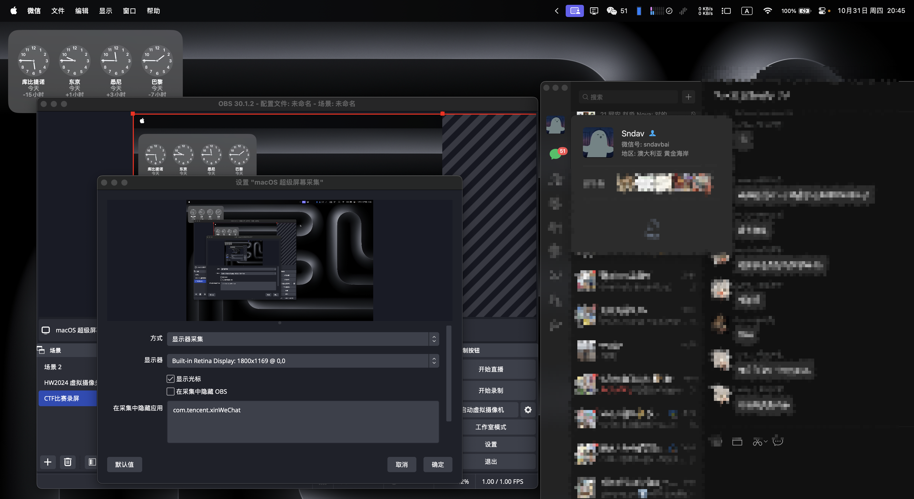

# OBS MacOS Capture X

MacOS 超级屏幕录制，可以支持将特定应用排除

## 使用教程

将`macos-capture-x.plugin` 放到 `~/Library/Application Support/obs-studio/plugins`

添加超级屏幕录制。如下图，即可隐藏特定应用

## 编译

1. 安装配置 https://github.com/obsproject/obs-deps
2. mkdir build && cd build && cmake .. -DCMAKE_BUILD_TYPE=Release && make -j16